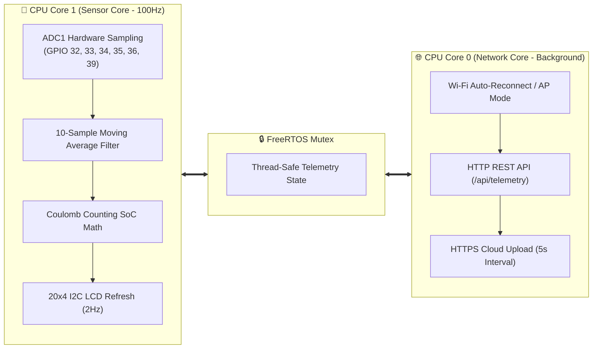

# 🌿 VoltraBloom — Hybrid Energy Harvesting System

> **A smart IoT device** that simultaneously harvests energy from **solar panels**, **vertical-axis wind turbines (VAWT)**, and **Soil Microbial Fuel Cells (SMFC)**, monitored in real-time by an ESP32 microcontroller with FreeRTOS dual-core tasking, an interactive 3D web dashboard, and Supabase cloud database logging.

---

## 📁 Clean Project Structure

```text
VOLTRA/
├── README.md                               ← 📖 Master documentation & hardware wiring guide
│
├── 🌐 Web & 3D Applications (Open directly in any browser)
│   ├── index.html                          ← ⭐ Live 3D showcase & real-time telemetry dashboard (Chart.js + Three.js)
│   ├── viewer_3d.html                      ← Standalone 3D prototype viewer (alias: p.html)
│   └── box_akrilik_designer.html           ← 3D acrylic enclosure CAD designer
│
├── ⚡ firmware/                            ← ESP32 Firmware Source Code
│   ├── Project_Voltrabloom_Unified/        ← ⭐ RECOMMENDED: FreeRTOS Dual-Core Firmware v3.0
│   │   ├── Project_Voltrabloom_Unified.ino ← Dual-Core tasking (Core 1: 100Hz Sensors / Core 0: IoT REST & Cloud)
│   │   ├── SupabaseLogger.h                ← Non-blocking HTTPS logger
│   │   ├── supabase_schema.sql             ← PostgreSQL table definitions & hourly aggregation
│   │   └── .clangd
│   ├── Project_Voltrabloom/                ← Standalone WiFi AP + Local Web Server
│   │   └── Project_Voltrabloom.ino
│   ├── Project_Voltrabloom_Supabase/       ← Cloud IoT logger (Supabase telemetry)
│   │   ├── Project_Voltrabloom.ino
│   │   └── SupabaseLogger.h
│   └── tester_pertama/                     ← 🧪 Hardware & Sensor Calibration Firmware (No WiFi)
│       └── tester_pertama.ino
│
├── 📐 3d_models/                           ← 3D CAD, STL, GLB & SVG Model Assets
│   ├── Frantic_Kasi.glb / .stl / .svg      ← Optimized 3D model iterations
│   ├── Frantic_Kasi_v1.glb / .stl / .svg   ← Original 3D models
│   └── archives/                           ← Zip packages of 3D exports
│
├── 📑 documents/                           ← Research & Engineering Documentation
│   ├── papers/                             ← Scientific papers & research publications
│   │   ├── PAPER_VOLTRA.pdf
│   │   ├── PAPER_VOLTRA.docx
│   │   └── VoltraBloom_Paper_Updated.docx
│   ├── proposals/                          ← Project proposals & compliance forms
│   │   ├── Proposal_voltra.docx
│   │   └── 029_IZIN_DEVICE.docx
│   ├── schemas/                            ← System wiring & hybrid electrical schemas
│   │   ├── supabase_telemetry_schema.sql   ← Master SQL with hourly aggregation & retention
│   │   ├── system_hybrid_schema.pdf
│   │   └── ref_web.pdf
│   └── scripts/                            ← Documentation scripts & presentation drafts
│
├── 🎨 media/                               ← Visual Assets, Graphics & Photos
│   ├── posters/                            ← Project presentation posters (.png, .svg)
│   ├── logos/                              ← Official VoltraBloom brand logos (.webp)
│   ├── photos/                             ← Hardware prototypes & test bench photos
│   └── design_projects/                    ← Raw graphic design project files (.ipv)
│
├── 🛠️ tools/                               ← Utilities & Software Tools
│   └── Arduino IDE/                        ← Portable Arduino IDE environment
│
└── 🗄️ _archive_raw_downloads/               ← Safe backup archive of original download packages
```

---

## ⚡ FreeRTOS Dual-Core Firmware Architecture (v3.0)

The recommended **Unified Firmware** leverages the ESP32's dual Tensilica LX6 cores for zero-latency deterministic execution:



---

## 🔌 Hardware — ESP32 Pin Mapping

| Sensor / Module | GPIO Pin | ADC Channel | Signal / Function |
| --- | --- | --- | --- |
| **Solar Voltage** | GPIO 32 | ADC1_CH4 | Monocrystalline solar panel via 12V→3.3V divider |
| **Wind Voltage** | GPIO 35 | ADC1_CH7 | Vertical-axis wind generator via 5V→3.3V divider |
| **Soil MFC Voltage** | GPIO 34 | ADC1_CH6 | Soil Microbial Fuel Cell millivolt signal |
| **DC-DC Output** | GPIO 33 | ADC1_CH5 | Regulated DC bus voltage (10V→3.3V divider) |
| **Current Sensor IN** | GPIO 39 (VP) | ADC1_CH3 | ACS712-05B charging current input |
| **Current Sensor OUT** | GPIO 36 (VP) | ADC1_CH0 | ACS712-05B load discharge current output |
| **I2C LCD Display** | GPIO 21 (SDA) / 22 (SCL) | — | 20x4 Character LCD (I2C address: `0x27`) |

> ⚠️ **ADC1 Invariant:** All analog pins are strictly assigned to **ADC1** (GPIOs 32–39). ADC2 is hardware-blocked whenever Wi-Fi is active on ESP32.

---

## 🛠️ Required Libraries (Arduino IDE)

Install via **Arduino IDE → Sketch → Include Library → Manage Libraries**:

| Library | Author | Purpose |
| --- | --- | --- |
| `LiquidCrystal_I2C` | Frank de Brabander | 20x4 I2C character LCD control |
| `WiFi` | Espressif (Built-in) | ESP32 Wi-Fi Station & SoftAP management |
| `HTTPClient` | Espressif (Built-in) | REST API HTTPS client for Supabase logging |
| `WiFiClientSecure` | Espressif (Built-in) | TLS secure socket connection |

**Board Selection:** `ESP32 Dev Module`  
**Upload Speed:** `115200` baud

---

## ☁️ Supabase Cloud Database & Automated Hourly Aggregation

Execute [`documents/schemas/supabase_telemetry_schema.sql`](file:///c:/Users/Arfi/Downloads/VOLTRA/documents/schemas/supabase_telemetry_schema.sql) in your Supabase SQL Editor to provision:

1. **`telemetry` table**: Fast index on `created_at DESC` for live 5-second streaming.
2. **`telemetry_hourly` table**: Automated hourly rollup for long-term historical analytics.
3. **`aggregate_telemetry_hourly()`**: SQL function computing average voltages, peak generation, and total Watt-hours harvested.
4. **`cleanup_old_raw_telemetry(days)`**: Retention policy pruning raw 5s rows older than 30 days while preserving lifetime hourly summaries.

---

© 2026 VoltraBloom — Autonomous Hybrid Energy Harvesting Architecture.
